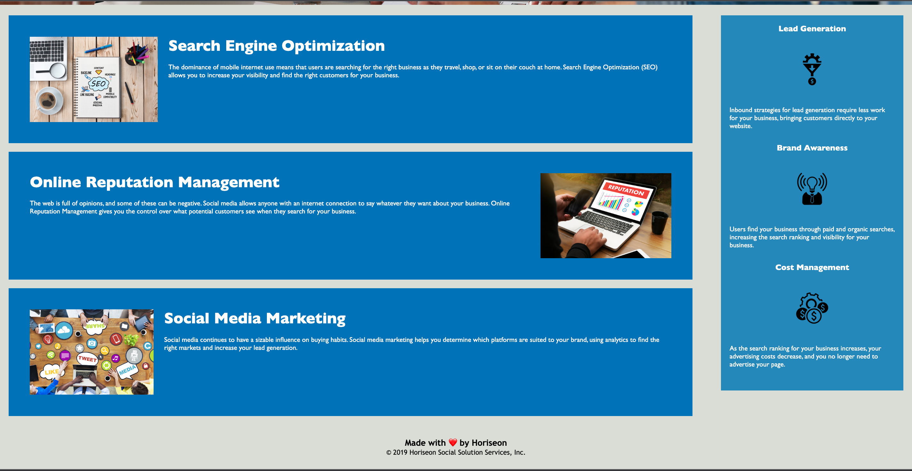

# Code Refactor

## Description
The original code was updated to follow accessibility standards in order to better optimize the site for search engines. This required using HTML semantic tags and restructuring the HTML elements in a more logical way, including an alt attribute in all img elements.
In addition, the code was commented more thoroughly and the CSS was reorganized and made more efficient by consolidating some selectors and properties.

## Purpose
Refactor the Horiseon site to have:

* Semantic HTML tags
* A logical structure of HTML elements
* Accessible alt attributes for images
* Heading attributes that fall in sequential order
* A concise, descriptive title

## Built With
* HTML
* CSS

## Screenshot of Webpage

## Link to Deployed Application

## Links:

* The URL of the deployed application.
https://tariqstanikzai.github.io/code-refactor/
* The URL of the GitHub repository.
 https://github.com/Tariqstanikzai/code-refactor